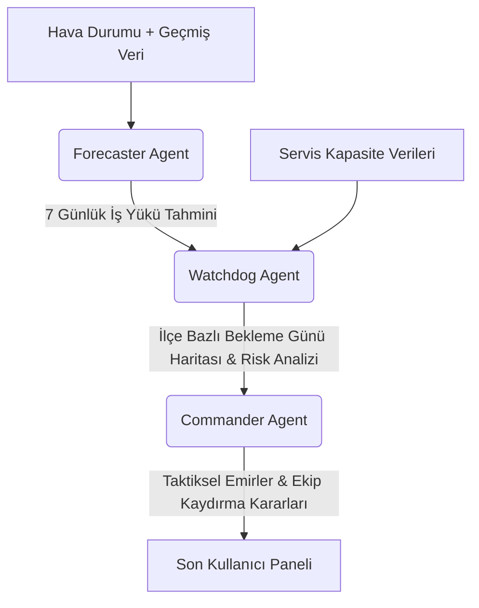

# ❄️ AC PROPHET - Kullanım Kılavuzu & Kitapçığı
## Samsung HVAC Peak Season Operations Control Center (Marmara Region)

AC PROPHET (Air Conditioning Prophet), Samsung HVAC (Isıtma, Havalandırma ve İklimlendirme) operasyonlarının yüksek sezon (Peak Season) döneminde Marmara Bölgesi'ndeki iş yükünü, servis kapasitelerini ve hava durumu tahminlerini analiz ederek optimize eden **Çoklu Ajan Tabanlı (Multi-Agent) bir Karar Destek Sistemidir**.

Bu kılavuz, uygulamanın teknik mimarisini, arayüz bileşenlerini, veri yönetimi süreçlerini ve günlük operasyonlarda nasıl kullanılacağını detaylandırmak amacıyla hazırlanmıştır.

---

## 🏗️ 1. Sistem Mimarisi ve Ajan Yapısı (Multi-Agent Core)

AC PROPHET, arka planda birbirleriyle entegre çalışan ve karar alma süreçlerini otomatikleştiren üç uzman yapay zeka ajanından (Gemini altyapılı) oluşur:

### 🧠 1.1. Forecaster Agent (Tahmin Ajanı)
*   **Görevi:** Önümüzdeki 7 gün boyunca hangi servis merkezine ne kadar yeni iş (ariza, montaj vb.) geleceğini tahmin eder.
*   **Çalışma Mantığı:** Geçmiş iş yükü trendlerini, hava tahmin raporundaki sıcaklık değişimlerini (HVAC talebi sıcaklık artışıyla doğrudan koreledir) ve mevcut birikmiş işleri (Carryover) analiz eder. Günler ilerledikçe bir önceki gün tamamlanamayan işleri bir sonraki güne devrederek gerçekçi bir birikme (backlog) simülasyonu zinciri oluşturur.

### 🛡️ 1.2. Watchdog Agent (Risk Denetim Ajanı)
*   **Görevi:** Forecaster'dan gelen tahminler ile servislerin mevcut kapasitelerini karşılaştırarak risk durumunu hesaplar.
*   **Çalışma Mantığı:** Her servis merkezinin günlük tamamlayabileceği maksimum iş adedini (Ekip Sayısı × Günlük Ekip Kapasitesi) baz alarak, bekleyen işlerin kaç günde eritilebileceğini (`Wait Days`) bulur. Bu değeri ilçe bazında analiz ederek şu durum kodlarını üretir:
    *   🟢 **Yeşil (0 - 3 Gün):** Servis güvenli bölgede, işleri zamanında bitirebiliyor.
    *   🟡 **Sarı (3.1 - 6 Gün):** İşlerde hafif yığılma var, yoğunluk izlenmeli.
    *   🔴 **Kırmızı (6.1+ Gün):** Kritik durum. İşlerin tamamlanması kabul edilemez sürelere ulaşıyor.

### 🫡 1.3. Commander Agent (Taktiksel Komuta Ajanı)
*   **Görevi:** Watchdog tarafından tespit edilen riskli bölgelere anında müdahale etmek için operasyonel taktikler üretir.
*   **Çalışma Mantığı:** "Kritik Durum" sınırını aşan (varsayılan: 4 gün) servisleri (Alıcılar) ve elinde atıl kapasite bulunan rahat durumdaki servisleri (Vericiler) tespit eder. Hangi servisten hangisine kaç ekip kaydırılması gerektiğini veya dış kaynak (outsource) desteği planlanması gerektiğini belirten resmi **Taktiksel Emirleri** yayınlar.

---

## 🖥️ 2. Arayüz Menüleri ve Kullanımı

Uygulama arayüzü 1 sol kontrol paneli ve 3 ana sekmeden oluşur.

### 🎛️ 2.1. Sol Panel (Sidebar - Parametreler)
*   **Samsung Logosu:** Kurumsal kimliği temsil eder.
*   **ASC Team Capacities:** Kapasite yönetiminin Admin sekmesinden yapıldığını hatırlatır.
*   **Commander Target Day:** Commander ajanının hangi günün risk tablosuna göre acil eylem planı (ekip kaydırma emri) üreteceğini belirler. Gelecek 7 günün gerçek tarihleri dinamik olarak bu listede yer alır.
*   **🚀 Run Multi-Agent Optimizer:** Tüm veri işlemeyi, hava durumu entegrasyonunu ve 3 ajanın sırayla çalışmasını başlatan ana tetikleyicidir.

---

### 📊 2.2. Operations Dashboard (Operasyon Paneli)
Ajanların çalışması bittikten sonra tüm çıktılar bu sekmede görselleştirilir:

1.  **7-Day Marmara Weather Forecast (Hava Durumu):** 
    *   Marmara Bölgesi'ndeki illerin 7 günlük ortalama sıcaklık tahminlerini listeler ve çizgi grafiği üzerinde gösterir.
    *   **İl Filtresi:** Listeden belirli bir ili seçerek sadece o ile ait hava durumu trendlerini detaylıca inceleyebilirsiniz.
2.  **🗺️ Risk Map Visualizer (İnteraktif Risk Haritası):**
    *   Marmara Bölgesi'nin ilçe sınırlarını içeren dinamik bir haritadır.
    *   **▶ Oynat / ⏸ Duraklat:** Sol alttaki oynat tuşuna basarak, 7 günlük bekleme sürelerinin ilçeler üzerinde günden güne nasıl değiştiğini (renk geçişleriyle) canlı bir animasyon olarak izleyebilirsiniz.
    *   Haritadaki ilçelerin üzerine geldiğinizde, o ilçenin bağlı olduğu **Servis Adı**, **Tarih**, **Tahmini Bekleme Günü** ve **Durum (Renk)** bilgisi anlık tooltip olarak görünür.
3.  **📊 7-Günlük Forecaster Projeksiyon Tablosu:**
    *   Ajanın ürettiği ham tahmin verilerini içerir.
    *   `Servis Adı Filtresi` ve `Tarih Filtresi` kullanarak sadece ilgilendiğiniz günün veya servisin tahmini iş, kapanan iş ve backlog detaylarını süzebilirsiniz.
4.  **🫡 Tactical Commander Orders:**
    *   Seçtiğiniz hedef gün (Target Day) için Commander ajanının yazdığı resmi operasyonel emirdir. Hangi servise nasıl destek olunacağı burada yazılı talimat olarak verilir.

---

### 📁 2.3. Data Management (Veri Yönetimi)
Bu sekme, sistemin veri tabanı olan `Jobsdata.xlsx` dosyasını arayüz üzerinden düzenlemenizi sağlar:

1.  **Günlük Manuel Veri Girişi:**
    *   **Kayıt Tarihi Seçin:** Giriş yapacağınız gerçek tarihi takvimden seçin.
    *   Açılan tabloda ilgili güne ait servis bazlı verileri (`CARRYOVER_JOBS`, `NEW_ASSIGNED_JOBS`, `CANCELLED_JOBS`, `COMPLETED_JOBS`) doğrudan hücrelerin içine yazın.
    *   **💾 Günlük Veriyi Kaydet:** Butonuna bastığınızda sistem `ACTIVE_BACKLOG` değerini formülle otomatik hesaplar ve Excel dosyasının altına yeni satırlar olarak ekler.
2.  **Toplu Excel Yükleme:**
    *   Excel şablonuna uygun toplu verileri sürükleyip bırakarak yükleyebilirsiniz. Yüklenen dosya önizlendikten sonra **"Tarihçeye Ekle (Append)"** butonu ile ana veritabanına eklenir.
3.  **Geçmiş Veri Düzenleyici (Data Fixer):**
    *   `Jobsdata.xlsx` içindeki tüm satırları doğrudan ekranda gösterir.
    *   Yanlış girilmiş geçmiş bir veriyi, yazım hatasını veya tarihi doğrudan hücreye tıklayarak düzeltebilir, ardından **"💾 Tüm Değişiklikleri Excel'e Kaydet"** butonuyla kalıcı hale getirebilirsiniz.

---

### ⚙️ 2.4. Admin (Marmara Services & Mapping)
Sistem yöneticilerinin servisleri, kapasiteleri ve coğrafi eşleşmeleri yönettiği alandır:

1.  **🛠️ Commander Agent Ayarları:**
    *   **Commander Destek İhtiyacı Eşiği (Gün):** Ajanın alarm durumuna geçmesi için bekleme gün sınırını belirler (Örn: 4.0 gün yapıldığında, bekleme süresi 4 günü aşan her servis için ekip kaydırma planı oluşturulur).
2.  **Servis Kapasite Yönetimi Tablosu:**
    *   Sistemde tanımlı tüm servis merkezlerinin kodları (`ASC_CODE`), isimleri (`ASC_NAME`), bağlı oldukları il (`City`), bünyelerindeki aktif ekip sayısı (`Team Quantity`) ve ekip başına günlük iş kapatma kapasiteleri (`Job Completion Capacity`) listelenir.
    *   Bu tablodaki ekip sayılarını veya kapasiteleri değiştirip **"💾 Save Configurations"** dediğinizde `ServiceList.xlsx` güncellenir ve simülasyon sonuçları anında değişir.
3.  **🗺️ Service District Mapping (İlçe-Servis Eşleşmesi):**
    *   İlçelerin hangi servis merkezinin sorumluluğunda olduğunu belirleyen kritik alandır.
    *   Ekranda listelenen interaktif tabloda, Marmara Bölgesi'ndeki her bir ilçenin karşısındaki `ATANAN_ASC_CODE` ve `ATANAN_ASC_ADI` kolonlarını güncelleyip **"💾 İlçe-Servis Eşleşmesini Kaydet ve Uygula"** butonuna basarak haritanın coğrafi dağılım mantığını anında değiştirebilirsiniz.
    *   **📂 Alternatif Yeni Excel Yükleme:** Büyük çaplı değişikliklerde şablonu Excel olarak dışarıda hazırlayıp topluca sisteme yüklemek için bu genişletilebilir alanı kullanabilirsiniz.

---

## 📊 3. Veri Yapısı ve Dosya Düzeni

Sistemin kararlı çalışması için klasördeki şu dosyaların yapısı bozulmamalıdır:

| Dosya Adı | Format | İçerik ve Görevi | Güncelleme Yöntemi |
| :--- | :--- | :--- | :--- |
| `Jobsdata.xlsx` | Excel | Servislerin günlük iş hacmi tarihçesi | Veri Yönetimi Sekmesi / Data Fixer |
| `ServiceList.xlsx` | Excel | Servis tanımlamaları, ekip sayıları ve kapasiteleri | Admin Sekmesi / Save Configurations |
| `marmara_ilce_listesi.xlsx` | Excel | İlçe bazlı servis eşleşmesi veri kaynağı | Admin Sekmesi / Service District Mapping |
| `service_district_map.json` | JSON | Arayüzün okuduğu hızlı ilçe eşleşme haritası | Sistem tarafından otomatik üretilir |
| `marmara_ilce_geojson.json` | GeoJSON | Marmara ilçelerinin harita sınır koordinatları | **Kesinlikle değiştirilmemelidir.** |

> [!WARNING]
> Excel dosyalarındaki kolon isimleri (Örn: `ASC_CODE`, `POSTING_DATE`, `Team Quantity`, `İLÇE`) büyük-küçük harfe duyarlıdır ve veri işlemenin düzgün yapılabilmesi için asla değiştirilmemelidir.

---

## 🛠️ 4. Sık Karşılaşılan Durumlar ve Sorun Giderme

### ❓ Haritada bazı ilçeler gri renkte kalıyor ve "Veri Yok" görünüyor.
*   **Sebep:** `marmara_ilce_listesi.xlsx` dosyasında o ilçenin karşısındaki `ATANAN_ASC_CODE` alanı boş bırakılmış veya geçersiz/yanlış yazılmış olabilir.
*   **Çözüm:** **Admin** sekmesindeki **Service District Mapping** tablosuna gidin, gri kalan ilçeyi bulun ve karşısına sistemde tanımlı geçerli bir servis kodu girerek kaydedin.

### ❓ Yaptığım veri girişleri veya kapasite değişiklikleri haritaya anında yansımıyor.
*   **Çözüm:** Değişikliği yaptıktan sonra ilgili kaydetme butonuna bastığınızdan emin olun. Arayüzün yeni durumu algılaması için sol paneldeki **🚀 Run Multi-Agent Optimizer** butonuna basarak simülasyonu yeniden çalıştırmalısınız.

### ❓ Simülasyonda tüm servisler hep yeşil çıkıyor, kriz senaryosunu test edemiyorum.
*   **Çözüm:** Test amaçlı kriz yaratmak için **Admin** sekmesindeki servis tablosundan ilgili servisin **Team Quantity (Ekip Sayısı)** değerini (örneğin 1'e veya 2'ye) düşürün ve **Save Configurations** yaptıktan sonra sistemi yeniden çalıştırın. Bekleme gün sayısı hızlıca yükselecek ve Commander devreyecektir.

---

*AC PROPHET ile başarılı, verimli ve stressiz bir Peak Season operasyon sezonu geçirmeniz dileğiyle!* ❄️📈
