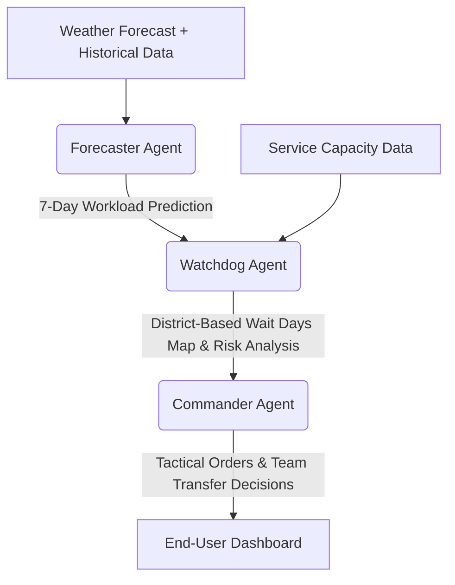

# ❄️ AC PROPHET - User Manual & Guidebook
## Samsung HVAC Peak Season Operations Control Center (Marmara Region)

AC PROPHET (Air Conditioning Prophet) is a **Multi-Agent Based Decision Support System** designed to analyze and optimize workload, service capacities, and weather predictions for Samsung HVAC (Heating, Ventilation, and Air Conditioning) operations during summer peak seasons.

This manual is prepared to detail the technical architecture of the application, its interface components, data management processes, and how to use it in daily operations.

---

## 🏗️ 1. System Architecture and Agent Structure (Multi-Agent Core)

AC PROPHET consists of three specialized AI agents (powered by Gemini) working cooperatively and integrating decision-making in the background:

### 🧠 1.1. Forecaster Agent
*   **Role:** Predicts how many new service jobs (breakdown, installation, etc.) will be assigned to each service center over the next 7 days.
*   **Workflow:** Analyzes historical workload trends, temperature changes from future weather reports (since HVAC demand correlates directly with temperature spikes), and active pending backlogs. It sequentially chains unresolved end-of-day backlog (Carryover) to the next day's forecast to construct a realistic backlog simulation.

### 🛡️ 1.2. Watchdog Agent
*   **Role:** Evaluates operational risks by matching the Forecaster's predictions with the actual daily working capacities of service centers.
*   **Workflow:** Calculates how many days it will take to resolve pending backlogs (`Wait Days`) based on each service center's daily completion limit (Active Teams × Daily Team Capacity). It analyzes this on a district level to generate status alarms:
    *   🟢 **Green (0 - 3 Days):** Service center is in the safe zone; jobs are resolved in a timely manner.
    *   🟡 **Yellow (3.1 - 6 Days):** Moderate backlog accumulation; needs close monitoring.
    *   🔴 **Red (6.1+ Days):** Critical situation. Backlog resolution time is reaching unacceptable levels.

### 🫡 1.3. Commander Agent
*   **Role:** Formulates immediate tactical dispatch and team reallocation plans to support critical service centers.
*   **Workflow:** Detects service centers exceeding the critical wait period threshold (default: 4 days) as "Receivers" and identifies relaxed service centers with surplus capacities as "Givers". It publishes formal **Tactical Orders** detailing exactly how many teams should be reallocated from Givers to Receivers.

---

## 🖥️ 2. User Interface and Functionality

The application interface consists of 1 sidebar control panel and 3 main content tabs.

### 🎛️ 2.1. Sidebar (Parameters Panel)
*   **Samsung Logo:** Represents the corporate brand.
*   **ASC Team Capacities:** Reminds that service capacities are managed in the Admin tab.
*   **Commander Target Day:** Selects the specific forecast date for which the Commander Agent will compile tactical dispatch actions. The list dynamically populates with the actual dates of the upcoming 7 days.
*   **🚀 Run Multi-Agent Optimizer:** The main trigger button that executes weather fetching, data processing, and coordinates the AI agent pipeline execution.

---

### 📊 2.2. Operations Dashboard
All compiled agent predictions and risk evaluations are visualized in this tab:

1.  **7-Day Marmara Weather Forecast:** 
    *   Lists 7-day average temperature predictions for Marmara Region cities and plots them on a line chart.
    *   **City Filter:** Allows users to select a single city to inspect local temperature trends in detail.
2.  **🗺️ Risk Map Visualizer (Choropleth Map):**
    *   A dynamic geographical map containing district boundaries of the Marmara region.
    *   **▶ Play / ⏸ Pause:** Click the play button at the bottom-left to watch district-level wait times animate day-by-day across the 7-day timeline.
    *   Hovering over districts displays tooltips with the **Service Name**, **Date**, **Estimated Wait Days**, and **Status**.
3.  **📊 7-Day Forecaster Projection Table:**
    *   Presents the raw predicted workload metrics generated by the Forecaster.
    *   Filter dropdowns for `Service Name` and `Date` let you sift through specific rows easily.
4.  **🫡 Tactical Commander Orders:**
    *   Displays the formal written tactical plan and team transfer allocations drafted by the Commander for the selected Target Day.

---

### 📁 2.3. Data Management
This tab is designed to interactively manage and update the database file `Jobsdata.xlsx` from the browser screen:

1.  **Daily Manual Entry:**
    *   **Select Date:** Pick the actual date of record from the calendar widget.
    *   Fill out the generated tabular row for each active service center (`CARRYOVER_JOBS`, `NEW_ASSIGNED_JOBS`, `CANCELLED_JOBS`, `COMPLETED_JOBS`).
    *   **💾 Save Daily Data:** Clicking this will automatically calculate the `ACTIVE_BACKLOG` formula and append the new entries to `Jobsdata.xlsx`.
2.  **Bulk Excel Upload:**
    *   Drag and drop bulk spreadsheets formatted to the template to instantly merge and append historical data.
3.  **Geçmiş Veri Düzenleyici (Data Fixer):**
    *   Displays the entire historical `Jobsdata.xlsx` sheet as an interactive grid. Double-click and edit any cell directly on-screen and save changes permanently back to the spreadsheet.

---

### ⚙️ 2.4. Admin (Marmara Services & Mapping)
Designed for administrators to configure service variables and district boundaries:

1.  **🛠️ Commander Agent Settings:**
    *   **Commander Support Threshold (Days):** Sets the wait time alarm threshold (e.g. 4.0 days triggers action for any service exceeding 4.0 wait days).
2.  **Service Capacity Settings:**
    *   Displays codes (`ASC_CODE`), names (`ASC_NAME`), base cities (`City`), active teams (`Team Quantity`), and daily team capacities (`Job Completion Capacity`) for all active ASCs. Edits are saved directly to `ServiceList.xlsx` to update forecasts instantly.
3.  **🗺️ Service District Mapping:**
    *   Specifies which districts are assigned to which service centers.
    *   Directly modify the `ATANAN_ASC_CODE` and `ATANAN_ASC_ADI` columns for any district in the grid and click **"Save and Apply"** to update `marmara_ilce_listesi.xlsx` and rebuild `service_district_map.json` in the background.
    *   **📂 Upload Excel Template:** Embeds a secondary file uploader for bulk district mapping uploads.

---

## 📊 3. Data Structure and File Layout

To ensure pipeline stability, the following directory files must keep their default headers and formats:

| File Name | Format | Content & Responsibility | Update Mechanism |
| :--- | :--- | :--- | :--- |
| `Jobsdata.xlsx` | Excel | Historical service workloads and backlogs | Data Management Tab / Data Fixer |
| `ServiceList.xlsx` | Excel | Service definitions, team counts and capacities | Admin Tab / Save Configurations |
| `marmara_ilce_listesi.xlsx` | Excel | District-to-service assignment source sheet | Admin Tab / Service District Mapping |
| `service_district_map.json` | JSON | Background lookup mapping for high-speed rendering | Rebuilt automatically upon saving edits |
| `marmara_ilce_geojson.json` | GeoJSON | Geographic district coordinates for map rendering | **Must never be modified.** |

> [!WARNING]
> Column headers in all Excel spreadsheets (e.g., `ASC_CODE`, `POSTING_DATE`, `Team Quantity`, `İLÇE`) are case-sensitive and must never be altered or renamed.

---

## 🛠️ 4. Frequently Asked Questions & Troubleshooting

### ❓ Some districts are colored in grey and display "No Data".
*   **Cause:** The district has not been assigned a valid service center code in the `marmara_ilce_listesi.xlsx` sheet.
*   **Solution:** Go to **Admin** -> **Service District Mapping**, find the greyed-out district, assign a valid active service center code, and save the configurations.

### ❓ Data edits or capacity changes are not showing on the dashboard.
*   **Solution:** Make sure you click the corresponding save buttons first. Then, run the simulation again by clicking **🚀 Run Multi-Agent Optimizer** in the sidebar to recalculate the predictions.

### ❓ All services are constantly Green; I want to simulate a crisis.
*   **Solution:** To trigger a backlog crisis, go to the **Admin** tab, reduce the **Team Quantity** of a service center to a low number (e.g. 1 or 2), click **Save Configurations**, and run the optimizer again. The wait days will rise rapidly, triggering a Red alarm and forcing the Commander to take action.

---

*Wishing you a successful, efficient, and stress-free Peak Season operation with AC PROPHET!* ❄️📈
