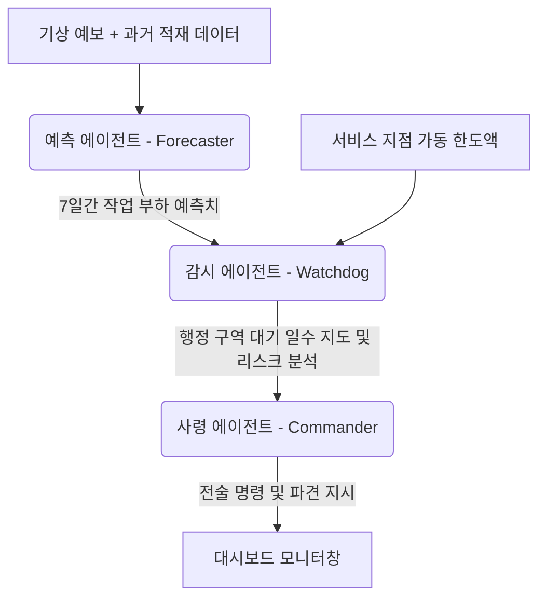

# ❄️ AC PROPHET - 상세 사용자 매뉴얼 & 안내서
## 삼성 HVAC 성수기 운영 관리 및 의사결정 지원 컨트롤 센터 (Marmara 지역)

AC PROPHET (Air Conditioning Prophet)은 삼성 HVAC (heating, ventilation, and air conditioning) 사업부의 여름철 성수기(Peak Season) 극대화 단계에서, 마르마라 광역 자치 구역 내의 서비스 지점별 업무량, 가용한 수리 처리 용량 및 중기 기온 기상 예보를 지능적으로 연계 분석하는 **멀티 에이전트(Multi-Agent) 기반 협업형 의사결정 지원 시스템**입니다.

이 매뉴얼은 애플리케이션의 기술적 아키텍처, 인터페이스 구성 요소, 데이터 관리 프로세스 및 실제 운영에서 이를 활용하는 방법을 자세히 설명하기 위해 작성되었습니다.

---

## 🏗️ 1. 멀티 에이전트 아키텍처 및 에이전트 체계 (Multi-Agent Core)

AC PROPHET은 상호 협력하고 의사결정을 연계하는 3개의 독립된 전문 인공지능 에이전트(Gemini 기반)로 가동됩니다:

### 🧠 1.1. 예측 에이전트 (Forecaster Agent)
*   **역할:** 향후 7일간 각 서비스 센터에 새로 할당될 작업(고장, 설치 등)의 수량을 예측합니다.
*   **업무 흐름:** 과거 작업 부하 트렌드와 기상 에보의 기온 변화(온도 상승과 에어컨 수요의 직접적인 상관관계) 및 당일 기준 백로그를 분석합니다. 당일 처리되지 못한 잔여 작업(Carryover)을 다음 날 예측에 연쇄적으로 연결함으로써 현실적인 누적 백로그 시뮬레이션을 수행합니다.

### 🛡️ 1.2. 감시 에이전트 (Watchdog Agent)
*   **역할:** 예측된 작업 부하와 실제 지점 가동 한도액을 매칭하여 리스크 상태를 분석합니다.
*   **업무 흐름:** 각 서비스 센터의 일일 가동 차량 수량과 일일 한도 처릿수(Active Teams × Daily Team Capacity)를 대조하여 지연 예상 일수(`Wait Days`)를 산정하고 경보를 발령합니다:
    *   🟢 **녹색 (0 - 3일):** 안전 수준. 당일 들어온 작업이 원활히 소화되는 안전 구역입니다.
    *   🟡 **황색 (3.1 - 6일):** 백로그가 누적되기 시작하는 수준. 주의 깊은 모니터링이 요구됩니다.
    *   🔴 **적색 (6.1일 이상):** 위험 수준. 대기 지연율이 수용 불가한 범위에 진입했습니다.

### ♞ 1.3. 사령 에이전트 (Commander Agent)
*   **역할:** 위험 지점을 보강하기 위해 구체적인 인력 이동 배치 및 지원 전술 보고서를 작성합니다.
*   **업무 흐름:** 지정한 목표일에 대기 임계 시간(기본값: 4일)을 넘는 위기 지점을 수혜(Receiver) 대상으로 특정하고, 상대적으로 여유가 있는 지점을 제공자(Giver)로 선별합니다. Giver 지점으로부터 Receiver 지점으로 구체적으로 지원팀을 이동시키는 군용 규격의 배속 **전술 명령(Tactical Orders)**을 하달합니다.

---

## 🖥️ 2. 사용자 인터페이스 조작 가이드

애플리케이션 스크린은 1개의 사이드바 제어판과 3개의 메인 콘텐츠 탭으로 구성됩니다.

### 🎛️ 2.1. 사이드바 (사이드바 제어판)
*   **삼성 로고:** 브랜드 아이덴티티를 나타냅니다.
*   **ASC Team Capacities:** 서비스 지점 가동 설정 조율은 관리자(Admin) 탭에서 가동됨을 리마인드합니다.
*   **Commander Target Day:** 사령 에이전트가 지원 명령을 조율하는 기준일(Target Day)을 고릅니다. 7일간의 날짜 정보가 실시간 연동되어 표기됩니다.
*   **🚀 Run Multi-Agent Optimizer:** 기상 데이터를 파이프라인 연계하고 3개의 에이전트 작업을 순차 기동시키는 메인 연산 시작 버튼입니다.

---

### 📊 2.2. Operations Dashboard (운영 대시보드)
모든 예측과 위험 경보 상태가 대시보드 화면상에 총괄 시각화됩니다:

1.  **7-Day Marmara Weather Forecast:** 
    *   주요 도시별 7일 평균 기온 데이터를 표기하며 라인 차트로 변동 추이를 렌더링합니다.
    *   **도시 필터:** 특정 도시를 픽하여 해당 지역의 국소 온도 패턴만 선별적으로 볼 수 있습니다.
2.  **🗺️ Risk Map Visualizer (위험 지역 지도):**
    *   행정 구역 좌표 경계 정보가 포함된 인터랙티브 코로플레스 지도입니다.
    *   **▶ 재생 / ⏸ 일시정지:** 스크린 좌하단의 버튼을 통해 7일간의 리스크 증감 시뮬레이션 과정을 동영상처럼 감상합니다.
    *   마우스 오버 시, 해당 구역 전담 서비스명, 타깃 일자, 상세 대기 일수 및 경보 툴팁이 팝업됩니다.
3.  **📊 7-Day Forecaster Projection Table:**
    *   예측 에이전트가 도출한 원본 백로그 예측 시트를 렌더링합니다.
    *   `지점명` 및 `날짜` 필터를 활용해 로우 단위 서칭이 가능합니다.
4.  **♞ Tactical Commander Orders:**
    *   선택일 기준 사령 에이전트가 조문 형태로 하달한 파견 전술 지시사항을 텍스트창에 출력합니다.

---

### 📁 2.3. Data Management (데이터 관리)
엑셀 로컬 DB 파일인 `Jobsdata.xlsx`를 브라우저 스크린상에서 실시간 조작하고 보존합니다:

1.  **일일 수동 데이터 입력:**
    *   달력 위젯에서 실시간 기록할 실제 날짜를 지정합니다.
    *   그리드에서 각 지점별 할당량, 완료율 등의 세부 수치(`CARRYOVER_JOBS`, `NEW_ASSIGNED_JOBS`, `CANCELLED_JOBS`, `COMPLETED_JOBS`)를 기입합니다.
    *   **💾 저장 버튼:** 등록 시 자동으로 백그라운드 수식 계산을 주도하여 `ACTIVE_BACKLOG` 값을 구하고 엑셀 파일 밑단에 append 합니다.
2.  **대량 엑셀 업로드:**
    *   템플릿에 부합하는 대형 히스토리 파일을 화면에 드래그하여 결합(Merge)합니다.
3.  **과거 데이터 수정기 (Data Fixer):**
    *   적재된 엑셀 내부의 전체 행을 직관적 에디팅 가능한 표 형태로 불러옵니다. 수정 후 즉시 엑셀 시트에 변경 사항을 씁니다.

---

### ⚙️ 2.4. Admin (Marmara Services & Mapping)
관리자가 기본 용량 한도액 및 구역 매핑 마스터 테이블을 조정하는 공간입니다:

1.  **🛠️ Commander Agent Settings:**
    *   **임계 대기일 한도:** 사령 에이전트가 위험으로 간주할 최대 한도(예: 4.0일 지정 시, 4일 초과 지점만 서포트 대상 편입).
2.  **서비스 용량 설정 테이블:**
    *   모든 가동 지점 코드(`ASC_CODE`), 지점명(`ASC_NAME`), 거점 도시(`City`), 팀 차량 대수(`Team Quantity`), 팀당 완료 한계(`Job Completion Capacity`)를 보여줍니다. 수정 시 `ServiceList.xlsx`에 영구 기록됩니다.
3.  **🗺️ Service District Mapping:**
    *   행정 구역이 특정 서비스 센터의 영역으로 결합하는 마스터 정의부입니다.
    *   테이블 그리드상에서 특정 구역의 `ATANAN_ASC_CODE` 및 `ATANAN_ASC_ADI` 컬럼 값을 기입하고 **"Kaydet ve Uygula (저장 및 적용)"**를 누르면, `marmara_ilce_listesi.xlsx`에 저장되며 Harita 구동용 `service_district_map.json`이 자동 파싱 재생성됩니다.
    *   **📂 템플릿 엑셀 업로드:** 대대적인 변경 시 외부에서 시트를 기입해 대량 엎어쓰는 기능입니다.

---

## 📊 3. 데이터 구조 및 시스템 파일 규칙

AC PROPHET 시스템이 무결하게 동작하기 위해 하위 테이블 파일들의 컬럼 구조가 상시 유지되어야 합니다:

| 파일 이름 | 포맷 | 내용 및 역할 | 갱신 방법 |
| :--- | :--- | :--- | :--- |
| `Jobsdata.xlsx` | Excel | 지점별 역사적 누적 처리 이력, 대기 잔량 및 완료 지표 | Data Management 탭 / Data Fixer |
| `ServiceList.xlsx` | Excel | 모든 지점의 기동 팀 수, 기초 완료 한도액 | Admin 탭 / Save Configurations |
| `marmara_ilce_listesi.xlsx` | Excel | 행정 지리 좌표 아이디와 지점 코드 결합 매핑 시트 | Admin 탭 / Service District Mapping |
| `service_district_map.json` | JSON | 지도 고속 렌더링을 지원하기 위해 자동 빌드되는 중간 파일 | 매핑 편집 및 저장 시 자동 재생성 |
| `marmara_ilce_geojson.json` | GeoJSON | 지도 형태를 구현하는 기하 좌표 정보 | **무단 변경 절대 금지** |

> [!WARNING]
> 엑셀 데이터 파일의 헤더명(예: `ASC_CODE`, `POSTING_DATE`, `Team Quantity`, `İLÇE`)은 대소문자를 엄격히 구분하므로 절대로 철자를 임의 변경해서는 안 됩니다.

---

## 🛠️ 4. 자주 묻는 질문 및 트러블슈팅

### ❓ 지도상의 특정 구역이 회색으로 나오고 "No Data (데이터 없음)"으로 표기됩니다.
*   **원인:** `marmara_ilce_listesi.xlsx` 내의 행정 아이디에 올바른 지점 배정 코드가 결합하지 못해 매핑 조인에 누락된 현상입니다.
*   **해결:** **Admin** -> **Service District Mapping**으로 이동하여 회색으로 표시된 구역을 찾고, 올바른 지점 코드를 할당한 뒤 변경사항을 저장하십시오.

### ❓ 대시보드 화면상에 수정한 값이나 용량이 바로 반영되지 않습니다.
*   **해결:** 세부 편집 테이블 아래에 있는 '저장' 버튼들을 정상 조작했는지 확인하십시오. 그 후, 예측 시나리오 연동을 위해 사이드바 상단의 **🚀 Run Multi-Agent Optimizer**를 클릭해 전체 시뮬레이션을 다시 재가동해야 합니다.

### ❓ 모든 지점이 항상 녹색(안전)으로만 모니터링됩니다. 위기 상황을 재현하고 싶습니다.
*   **해결:** **Admin** 탭에서 특정 센터의 가동 차량 대수(**Team Quantity**)를 임시로 1대 또는 2대로 극도로 줄이고 **Save Configurations**를 누릅니다. 그 후 최적화 실행을 다시 돌리면, 대기 지연(Wait Days) 곡선이 급격히 솟구치며 적색 알람이 발령되고 사령 보고서가 서포트 팀 파견 전술 명령을 유도합니다.

---

*AC PROPHET과 함께 이번 HVAC 여름 성수기 극대화 기간을 안정적이고 성공적으로 조율하시기를 바랍니다!* ❄️📈
